# Introduction
Customer retention is crucial for credit card companies, as keeping existing customers is more cost-effective than acquiring new ones. This project uses a Kaggle dataset to predict customer churn, helping banks identify at-risk customers and offer them better services or promotions to enhance loyalty.

🔍 We'll start with Exploratory Data Analysis (EDA) to uncover key trends and patterns. Next, we'll preprocess the data to prepare it for modeling, including encoding categorical variables, scaled numerical variables, and balancing the classes. ⚙️ We'll then select and tune machine learning models to find the most effective one for predicting churn. Finally, we'll evaluate the models and provide insights to help banks reduce customer attrition and improve their services. 📊

🔍 Check the notebook file out here: [Project Notebook](/project.ipynb)
# Background
Customer churn is a major concern for credit card companies, as retaining existing customers is generally more cost-effective than acquiring new ones. High churn rates can impact profitability and growth, making churn prediction a valuable tool for improving customer retention strategies.

The dataset used in this project, sourced from Kaggle, includes features related to credit card usage, and account details. By analyzing this data, we aim to build predictive models to identify at-risk customers and help credit card companies implement targeted interventions, such as personalized offers and enhanced services.

This background section provides an overview of customer churn issues in the credit card industry and the significance of using machine learning techniques to predict and reduce churn.
# Exploratory Data Analysis
The initial investigation focused on the percentage of customer attrition to assess the dataset's balance. It was found that the dataset is imbalanced, with existing customers representing a substantial 83.93%, compared to just 16.07% of attrited customers.

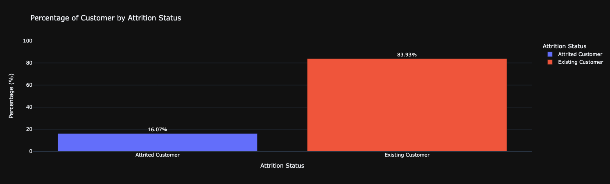
_Bar graph visualizing customer's attrition rate_

To identify correlations between variables, heatmaps were generated using both Spearman and Pearson correlation methods. This approach was chosen to account for potential linear or monotonic relationships between the variables. The goal is to determine which variables are associated with Attrited_Status.

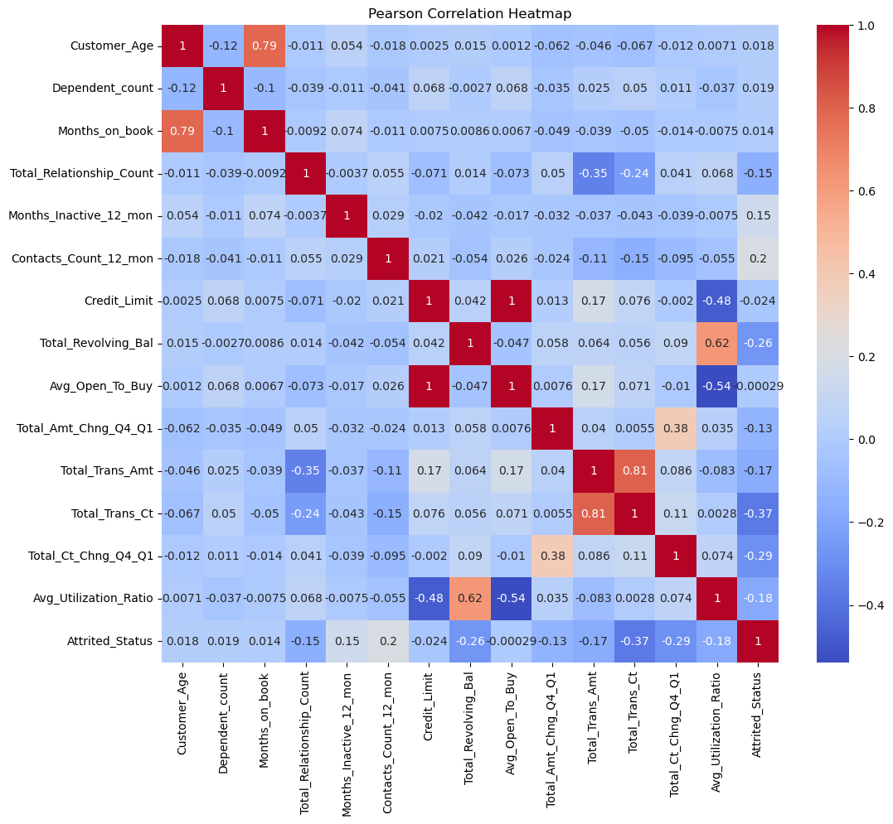
_Pearson Correlation Heatmap_

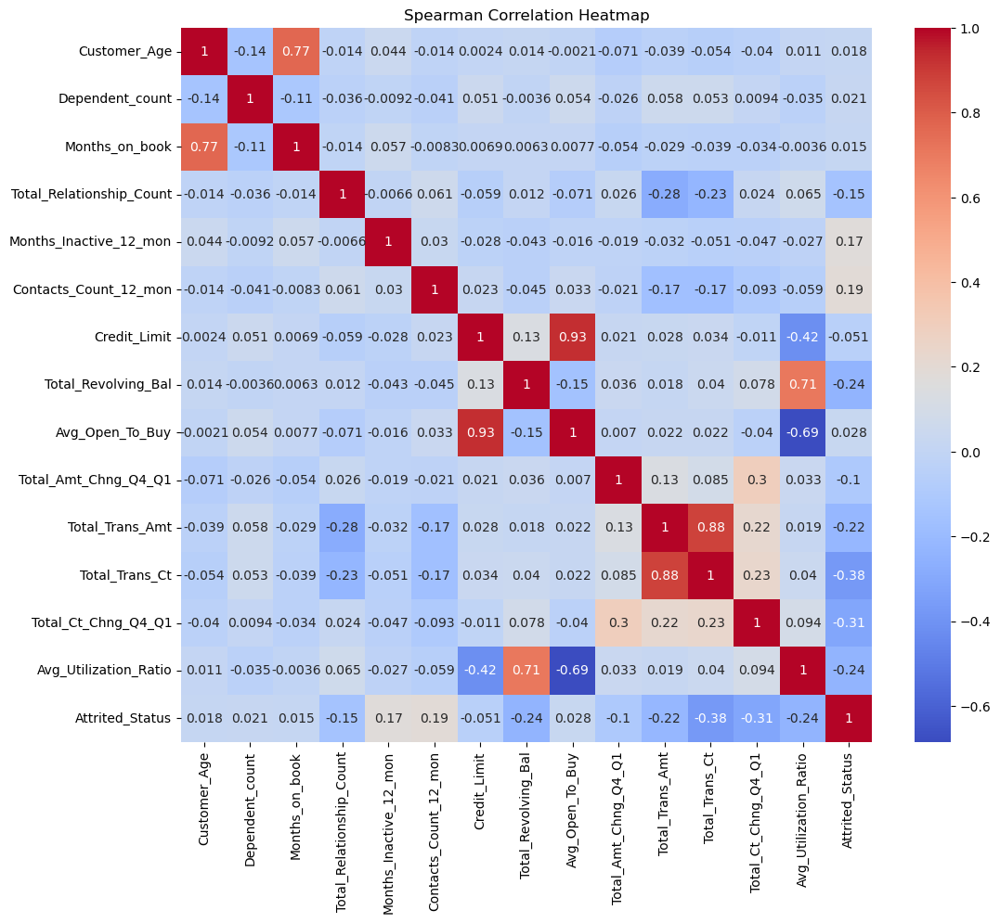
_Spearman Correlation Heatmap_

Based on these heatmaps, the following questions need to be examined:
1. From all cancellations what are the percentage for these categories?
   1. Gender
   2. Education Level
   3. Marital Status
   4. Annual Salary
   5. Card Type
2. What are the distribution of revovling balance in both existing and attrited customers?
3. What are the distribution of average utilization ratio in both existing and attrited customers?
4. Is it possible to classified customer status by using all time transaction count and amount?
5. Is it possible to classified customer status by using the change in transaction count and amount between Q4 and Q1?

### **1.1 From all cancellations what are the percentage for Gender?**
Based on the bar graph below, female customers are more likely to churn than male customers, with a churn rate of 57.16% compared to 42.84% for males.

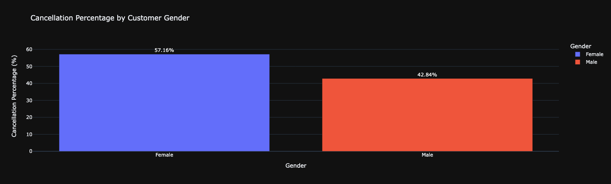
_Bar graph visualizing gender percentage on attrition customer_

### **1.2 From all cancellations what are the percentage for Education Level?**
According to the bar graph below, customers with a graduate education are the most likely to churn, followed by those with a high school education, unknown education status, and uneducated customers.

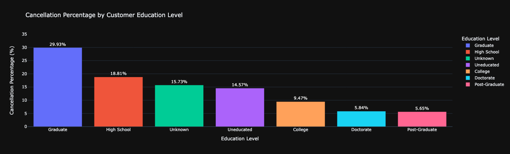
_Bar graph visualizing education level percentage on attrition customer_

### **1.3 From all cancellations what are the percentage for Marital Status?**
Married and single customers have nearly identical churn rates, at 43.58% and 41.06%, respectively, while other categories have churn rates of approximately 7-8%.

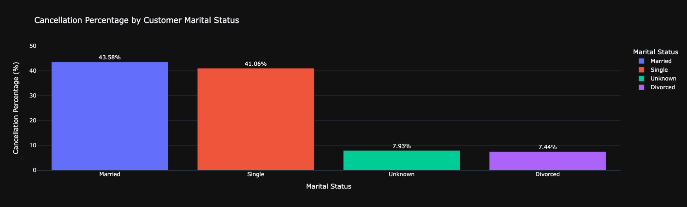
_Bar graph visualizing marital status percentage on attrition customer_

### **1.4 From all cancellations what are the percentage for Annual Salary?**
Customers with annual earnings below $40,000 have the highest churn rate, at 37.68%. In contrast, those earning over $120,000 per year have the lowest churn rate, at 7.74%. Other income groups have churn rates ranging from approximately 11% to 17%.

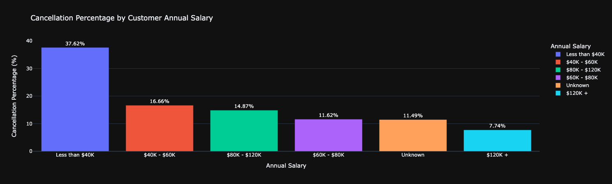
_Bar graph visualizing annual salary percentage on attrition customer_

### **1.5 From all cancellations what are the percentage for Card type?**
It is evident that nearly all churned customers hold a company blue card, with an exceptionally high percentage of 93.36%.

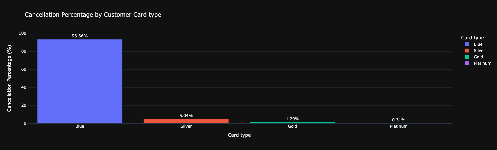
_Bar graph visualizing card type percentage on attrition customer_

### **2. What are the distribution of revovling balance in both existing and attrited customers?**
The boxplot below clearly indicates that existing customers have a higher median revolving balance of $1,364, while churned customers have a median of $0. This suggests that half of the churned customers have not utilized their revolving balance. 

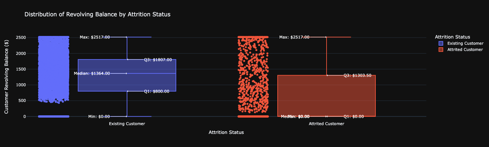
_Box plot visualizing revolving balance distribution by attrition status_

### **3. What are the distribution of average utilization ratio in both existing and attrited customers?**

Since half of the attrited customers have not used their revolving balance, it's unsurprising that the boxplot distribution for their utilization ratio is extremely low. Conversely, most existing customers appear to have used their credit cards up to a utilization ratio of 0.53, or around half of their available credit.

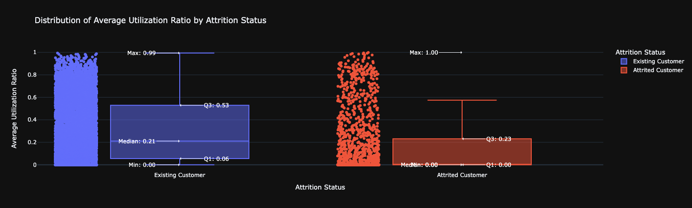
_Box plot visualizing average utilization ratio distribution by attrition status_

### **4. Is it possible to classified customer status by using all time transaction count and amount?**
According to the scatter plot below, most attrited customers have transaction counts ranging from 0 to 60 and transaction amounts between $0 and $5,000.

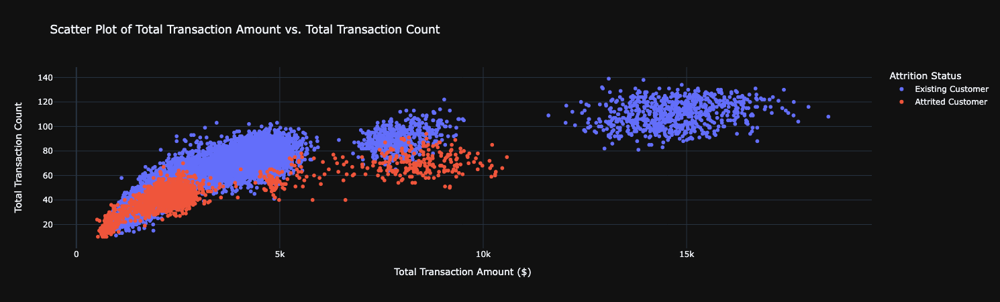
_Scatter plot visualizing the relation of total transaction amount and count by attrition status_

### **5. Is it possible to classified customer status by using the change in transaction count and amount between Q4 and Q1?**
It is evident that in Q4, nearly all churned customers made fewer transactions compared to Q1, and the total amount per transaction was also lower than in Q1.

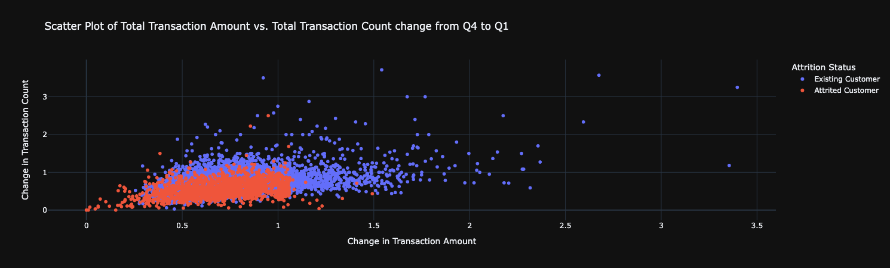
_Scatter plot visualizing the relation of the change transaction amount and count from Q4 to Q1 by attrition status_
# Data Preprocessing
# Model Selection and Tuning
# Model Training
# Model Evaluation
# Conclusion
# References